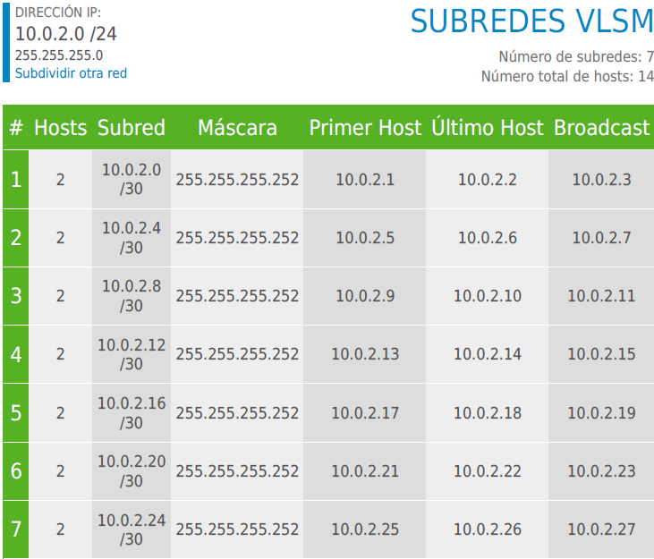
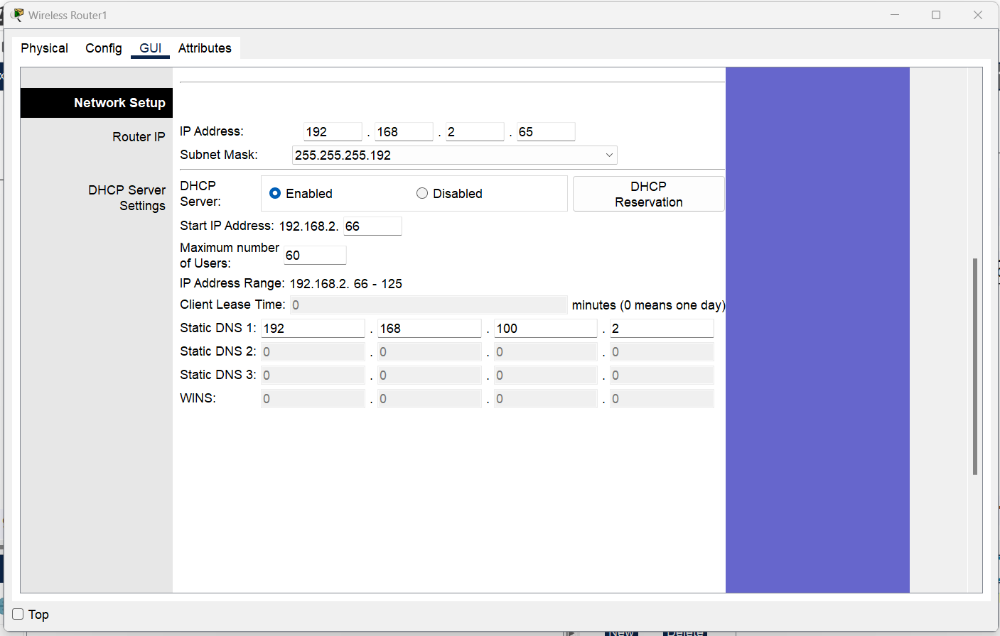

# Practica 2

## Topología propuesta

## Desglose de subnetting utilizado dividido entre VLSM y FLSM
### Red de Servers

### Red de Ruteo

### Red de VLANs

## Configuraciones DHCP tanto de servidores como de routers inalámbricos
### Server DHCP

### Router Piso 2

### Router Piso 3

## Configuración DNS y HTTP de servidor WEB
### Creacion de Dominio

### index.html

## Comandos utilizados
```
VLANs, Modo Acceso y Modo Troncal Switches Capa 2
Switch0 (Piso1)
vlan 12
name ADMIN
vlan 22
name ESTUDIANTES
interface fa0/12
switchport mode access
switchport access vlan 12
interface fa 0/11
switchport mode access 
switchport access vlan 22
interface range gig0/1-2
switchport mode trunk
switchport trunk allowed vlan 12,22,32,42

Switch1 (Data Center)
vlan 32
name WEB_SERVERS
vlan 42
name DHCP_SERVERS
interface fa0/11
switchport mode access
switchport access vlan 32
interface fa0/12
switchport mode access 
switchport access vlan 42
interface fa0/1
switchport mode trunk
switchport trunk allowed vlan 12,22,32,42

Configuración Routers: asignar IP, dhcp y encender interfaz
Router1 (Piso1)
interface gig0/0
ip address 10.0.2.22 255.255.255.252
no shutdown
interface gig0/1.12
ip helper-address 192.168.100.130
Router0 (Piso1)
interface gig0/0
ip address 10.0.2.26 255.255.255.252
no shutdown
interface gig0/1.22
ip helper-address 192.168.100.130

Configuración Switches capa 3
ip routing (En todos)

Multilayer Switch0 (Data Center)
interface fa0/5
switchport trunk encapsulation dot1q
switchport mode trunk
switchport trunk allowed vlan 12,22,32,42
vlan 32
name WEB_SERVERS
vlan 42
name DHCP_SERVERS
interface vlan 32
ip address 192.168.100.1 255.255.255.128
interface vlan 42
ip address 192.168.100.129 255.255.255.128

Configuración LACP
Multilayer Switch0 - Multilayer Switch1
MS0
interface range fa0/1-4
channel-group 1 mode active
interface port-channel 1
no switchport
ip address 10.0.2.1 255.255.255.252
MS1
interface range fa0/1-4
channel-group 1 mode active
interface port-channel 1
no switchport
ip address 10.0.2.2 255.255.255.252
interface gig0/1
no switchport
ip address 10.0.2.21 255.255.255.252
interface gig0/2
no switchport
ip address 10.0.2.25 255.255.255.252

Multilayer Switch1 - Multilayer Switch2
MS1
interface range fa0/5-8
channel-group 2 mode active
interface port-channel 2
no switchport
ip address 10.0.2.9 255.255.255.252

MS2
interface range fa0/1-4
channel-group 2 mode active
interface port-channel 2
no switchport
ip address 10.0.2.10 255.255.255.252
interface gig0/1
no switchport
ip address 10.0.2.5 255.255.255.252

Multilayer Switch1 - Multilayer Switch3
MS1
interface range fa0/9-12
channel-group 3 mode active
interface port-channel 3
no switchport
ip address 10.0.2.13 255.255.255.252

MS3
interface range fa0/1-4
channel-group 3 mode active
interface port-channel 3
no switchport
ip address 10.0.2.14 255.255.255.252
interface gig0/1
no switchport
ip address 10.0.2.17 255.255.255.252

Ruteo OSPF
Multilayer Switch1
router ospf 2
network 10.0.2.0 0.0.0.3 area 0
network 10.0.2.8 0.0.0.3 area 0
network 10.0.2.12 0.0.0.3 area 0
network 10.0.2.20 0.0.0.3 area 0
network 10.0.2.24 0.0.0.3 area 0

Multilayer Switch0
router ospf 2
network 10.0.2.0 0.0.0.3 area 0
network 192.168.10
network 192.168.100.0 0.0.0.127 area 0 
network 192.168.100.128 0.0.0.127 area 0

Multilayer Switch2
router ospf 2
network 10.0.2.8 0.0.0.3 area 0
network 10.0.2.4 0.0.0.3 área 0

Multilayer Switch3
router ospf 2
network 10.0.2.12 0.0.0.3 area 0
network 10.0.2.16 0.0.0.3 area 0

Router1
router ospf 2
network 10.0.2.20 0.0.0.3 área 0
network 192.168.2.0 0.0.0.63 area 0
network 192.168.2.192 0.0.0.15 area 0

Router0
router ospf 2 
network 10.0.2.24 0.0.0.3 área 0
network 192.168.2.0 0.0.0.63 area 0
network 192.168.2.192 0.0.0.15 area 0

HSRP
Router1(Piso1)
interface gig0/1.12
encapsulation dot1q 12
ip address 192.168.2.194 255.255.255.240
standby 1 ip 192.168.2.193
standby 1 priority 150
standby 1 preempt
interface gig0/1.22
encapsulation dot1q 22
ip address 192.168.2.2 255.255.255.192
standby 2 ip 192.168.2.1
standby 2 priority 150
standby 2 preempt

Router0(Piso1)
interface gig0/1.12
encapsulation dot1q 12
ip address 192.168.2.195 255.255.255.240
standby 1 ip 192.168.2.193
interface gig0/1.22
encapsulation dot1q 22
ip address 192.168.2.3 255.255.255.192
standby 2 ip 192.168.2.1
```
