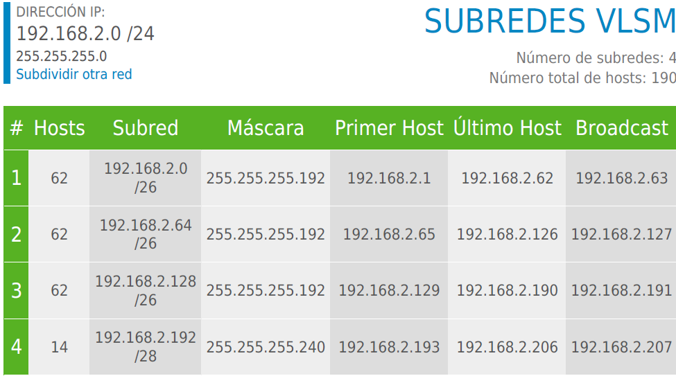
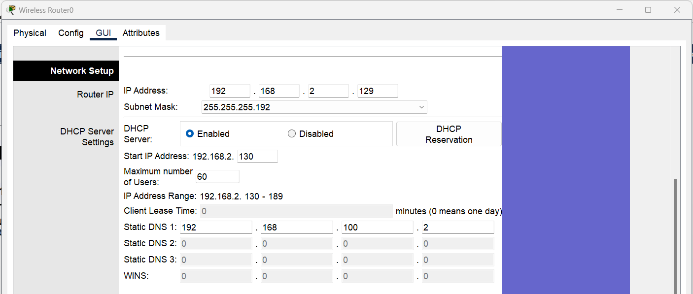
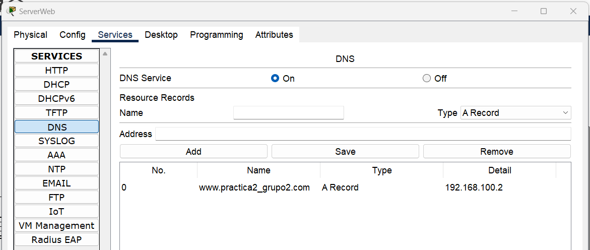

### Universidad San Carlos de Guatemala
### Facultad de ingeniería
### Escuela de ciencias y sistemas
### Modelación y simulación 1

#### INTEGRANTES
+ Steven S. Jocol Gomez	201602938
+ Angel Geovanny Ordon Colchaj	201905741
+ Saul Jafet Menchu Recinos	201906444
+ Carlos Augusto Hernández Ordoñez	201611269
+ Maxwellt Joel Ramirez Ramazzini 	201709328

### Introducción

### Objetivos

### Anexos
#### Tabla 1 tipos de clientes

La probabilidad del tipo de clientes que llegan a realizar un pedido es la siguiente.

#### Tabla 2 distribución de elección de flores
Distribución de flores, cumpliendo con una distribución uniforme respecto a cada tipo de flor.

### Tabla 3 Auto Tareas
Cuando se realiza la elección de un tipo de flor, tiene consigo una ponderiación, y la entidad

#### Proceso de elección
1. Selección de flores

Se realiza la validación, en el caso donde los items seleccionados (las flores) sean mayores a 4 se finaliza el proceso, en caso contrario, se sigue realización el proceso de asignación del valor de la variable **ModelEntity.Seleccion** aumentando su valor.

Seguido de la elección de flores, guiado en la tabla 2, donde se usa la propiedad __Flores.Probabilidad.RandomRow__.

Seguidamente de la decisión, si el tipo de Flor es Rosa, se le agrega la cantidad de rosas, más la cantidad de flores elegidas, y finaliza el proceso.
Se repite el proceso, con los demás tipos de flores: Rosas, Orquideas, Linos, Tulipanes, Girasoles.

2. selección de flores, realiza una condición: Si la elección de flores es mayor a 5 finaliza el proces, en caso contrario realiza lo siguiente:

El modelentity, la selección le aumenta un valor.
A la variable Flores, se le agrega selecciona un valor, basado siempre en la tabla 2, seguido el Flores.TipoFlor se le agrega el valor del tipo y la cantidad.

3. Notificación de orden completa

La cual consiste una condición de dos valores, donde Almacen.InputBuffer.Contents == 0 & Almacen.Processing.Contents==0, siendo el caso donde fuera falso finaliza el proceso, 
en caso contratio cuando lo realiza el evento OrdenCompleta

4. Incremento de tareas

Este proceso tiene como finalidad aumentar la fase de la selección en el caso de que aún no llegue al limite, utilizando un setRow, en el inicio se tiene una decisión, cuando
el ModelEntity.FaseSeleccion es mayor a 5 realiza la asignación ModelEntity.FaseSeleccion igual a 1-

Caso contrario, realiza la incrementación de ModelEntity.FaseSeleccion en uno, y setear el valor de la tabla de fase

5. Envio de flores al almacen
SetRow1, Decide3, Create1, Decide7, Wait2, Assign2, End: Estos elementos forman un flujo normal donde el ModelEntity.CantidadRosas llaman el valor a una variable, la decisión de finalizar este proceso en el mismo flujo es, donde Almacen.InputBuffer.Contents > 0 || Almacen.Processing.Contents > 0, si ambos valores son igual a 0. Seguido de a la espera de un evento con una acción.

Decide: Los múltiples nodos "Decide" indican puntos de bifurcación en el proceso, donde se toman decisiones basadas en ciertas condiciones.

Create: Estos nodos sugieren la creación de nuevas entidades o elementos dentro de la simulación. En el caso de que ya exista la transfiere y finaliza su valor, en caso contrario también finaliza el valor
Transfer: Indica la transferencia de entidades entre diferentes partes del sistema.
Wait: Representa un tiempo de espera o retraso en el proceso. En este caso la espera de un evento
Assign: Se utiliza para asignar valores a atributos de las entidades.

6. Incrementador de **OrdenesGeneradas**

7. El proceso de **cola de ordenes** donde el contenido del sistema automático, cuando tenga valor se quede a espera de un evento

8. Ciclo automático
El modelo evalua si la fase de selección si es menor a 5, se finaliza el proceso. En caso contrario se toma como valor del setNode en Selección Completa. Finaliza lanzando el evento Selección Terminada.

