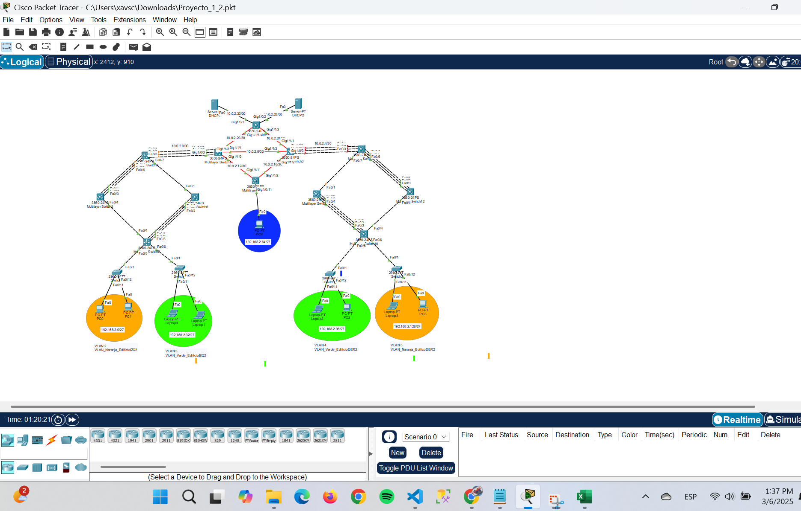

# Laboratorio redes de computadoras 2 
##  Manual Proyecto 1   

- Topologia solicitada 
  


- Divisiones de la red


### Configuración modo troncal 
```
Switches 3560
interface range fa0/#-#
switchport trunk encapsulation dot1q
switchport mode trunk
switchport trunk allowed vlan all
exit


Switches 3650
interface range gig1/0/#-#
switchport mode trunk
switchport trunk allowed vlan all
exit

Modo acceso
Switches 2960
interface fa0/#
switchport mode Access
switchport Access vlan #

```

### Configuracion VTP

```
# Configuración Servidor
## Para Multilayer Switch7 y Multilayer Switch11
enable
configure terminal
vtp mode server
vtp domain g2
vtp password grupo2
vtp version 2
do wr

# Configuración Modo Cliente
## Para el resto de Switches
enable
configure terminal
vtp mode client
vtp domain g2
vtp password grupo2
do wr

```

### Configuracion VLAN  (Solo en Switches servidores)

- Edificio: Izquierdo
```
enable
configure terminal
vlan 2
name VLAN_Naranja_EdificioIZQ2
vlan 3
name VLAN_Verde_EdificioIZQ2
```


###  VLAN (Solo en Switches servidores)

```
Edificio: Izquierdo
enable
configure terminal
vlan 2
name VLAN_Naranja_EdificioIZQ2
vlan 3
name VLAN_Verde_EdificioIZQ2

Edificio: Derecho
vlan 4
name VLAN_Verde_EdificioDER2
vlan 5
name VLAN_Naranja_EdificioDER2
```

### MODO ACCESO (Para las interfaces conectadas a las PC)
```
IZQUIERDA
Switch0
enable
configure terminal
interface range fa0/11-12
switchport mode access
switchport Access vlan 2 

Switch1
enable
configure terminal
interface range fa0/11-12
switchport mode access
switchport Access vlan 3
do wr

DERECHA

Switch2
enable
configure terminal
interface range fa0/11-12
switchport mode access
switchport Access vlan 4
do wr

Switch3
enable
configure terminal
interface range fa0/11-12
switchport mode access
switchport Access vlan 5
do wr
```
### Configuracion LACP (Edificio Izquierdo)
```
LACP (Edificio Izquierdo)

LACP Multilayer Switch8 - Multilayer Switch5
Multilayer Switch8
enable
configure terminal
interface range fa0/4-6
channel-group 2 mode active

interface port-channel 2
switchport trunk encapsulation dot1q
switchport mode trunk
switchport trunk allowed vlan all

Multilayer Switch5
enable
configure terminal
interface range fa0/1-3
channel-group 2 mode active

interface port-channel 2
switchport trunk encapsulation dot1q
switchport mode trunk
switchport trunk allowed vlan all

LACP Multilayer Switch6 - Multilayer Switch7

Multilayer Switch6
enable
configure terminal
interface range fa0/2-4
channel-group 2 mode active

interface port-channel 2
switchport trunk encapsulation dot1q
switchport mode trunk
switchport trunk allowed vlan all

Multilayer Switch7
enable
configure terminal
interface range fa0/1-3
channel-group 2 mode active

interface port-channel 2
switchport trunk encapsulation dot1q
switchport mode trunk
switchport trunk allowed vlan all

LACP Multilayer Switch8 - Multilayer Switch1
Multilayer Switch8
enable
configure terminal
interface range fa0/1-3
channel-group 1 mode active

interface port-channel 1
no switchport
ip address 10.0.2.2 255.255.255.252

Multilayer Switch1
enable
configure terminal
ip routing
interface range gig1/0/1-3
channel-group 1 mode active

interface port-channel 1
no switchport
ip address 10.0.2.1 255.255.255.252


IP virtual
Multilayer Switch8
enable
configure terminal
ip routing
interface vlan 2
ip address 192.168.2.1 255.255.255.224
interface vlan 3
ip address 192.168.2.33 255.255.255.224

```

### PAGP (Edificio Derecho)
```

PAGP Multilayer Switch9 - Multilayer Switch12
Multilayer Switch9
enable
configure terminal
interface range fa0/4-6
channel-group 3 mode auto

interface port-channel 3
switchport trunk encapsultaion dot1q
switchport mode trunk
swtichport trunk allowed vlan all

Multilayer Switch12
enable
configure terminal
interface range fa0/1-3
channel-group 3 mode desirable

interface port-channel 3
switchport trunk encapsulation dot1q
switchport mode trunk
switchport trunk allowed vlan all

PAGP Multilayer Switch11 - Multilayer Switch10
Multilayer Switch11
enable 
configure terminal
interface range fa0/2-4
channel-group 4 mode desirale

interface port-channel 4
switchport trunk encapsultaion dot1q
switchport mode trunk
swtichport trunk allowed vlan all

Multilayer Switch10
enable
configure terminal
interface range fa0/1-3
channel-group 4 mode desirable

interface port-channel 4
switchport trunk encapsultaion dot1q
switchport mode trunk
swtichport trunk allowed vlan all

PAGP Multilayer Switch3 - Multilayer Switch9
Multilayer Switch9
enable
configure terminal
interface range fa0/1-3
channel-group 6 mode auto

interface port-channel 6
no switchport
ip address 10.0.2.6 255.255.255.252

Multilayer Switch3
enable
configure terminal
interface range gig1/0/1-3
channel-group mode desirable

interface port-channel 6
no switchport
ip address 10.0.2.5 255.255.255.252

IP virtual
Multilayer Switch9
enable
configure terminal
ip routing
interface vlan 4
ip address 192.168.2.97 255.255.255.224
interface vlan 5
ip address 192.168.2.129 255.255.255.224

Multilayer Switch4
ip routing
interface Gig1/1/1
no switchport
ip address 10.0.2.21 255.255.255.252
interface Gig1/1/2
no switchport
ip address 10.0.2.25 255.255.255.252
interface Gig1/0/1
no switchport
ip address 10.0.2.33 255.255.255.252
interface Gig1/0/2
no switchport
ip address 10.0.2.29 255.255.255.252

Multilayer Switch1
ip routing
interface Gig1/1/1
no switchport
ip address 10.0.2.22 255.255.255.252
interface Gig1/1/3
no switchport
ip address 10.0.2.9 255.255.255.252
interface Gig1/1/2
no switchport
ip address 10.0.2.13 255.255.255.252

Multilayer Switch2
ip routing
interface Gig1/1/1
no switchport
ip address 10.0.2.14 255.255.255.252
interface Gig1/1/2
no switchport
ip address 10.0.2.17 255.255.255.252
interface Gig1/0/11
no switchport
ip address 192.168.2.65 255.255.255.224

Multilayer Switch3
ip routing
interface Gig1/1/1
no switchport
ip address 10.0.2.26 255.255.255.252
interface Gig1/1/3
no switchport
ip address 10.0.2.10 255.255.255.252
interface Gig1/1/2
no switchport
ip address 10.0.2.18 255.255.255.252

```

### RUTEO OSPF

```
Multilayer Switch8
router ospf 2
network 192.168.2.0 0.0.0.31 area 0
network 192.168.2.32 0.0.0.31 área 0
network 10.0.2.0 0.0.0.3 área 0

Multilayer Switch9
router ospf 2
network 192.168.2.96 0.0.0.31 área 0
network 192.168.2.128 0.0.0.31 área 0
network 10.0.2.4 0.0.0.3 área 0

Multilayer Switch1
router ospf 2
network 10.0.2.0 0.0.0.3 área 0
network 10.0.2.8 0.0.0.3 área 0
network 10.0.2.12 0.0.0.3 área 0
network 10.0.2.20 0.0.0.3 área 0

Multilayer Switch2
router ospf 2
network 10.0.2.12 0.0.0.3 área 0
network 10.0.2.16 0.0.0.3 área 0
network 192.168.2.64 0.0.0.31 área 0

Multilayer Switch4
router ospf 2
network 10.0.2.20 0.0.0.3 área 0
network 10.0.2.24 0.0.0.3 área 0
network 10.0.2.28 0.0.0.3 área 0
network 10.0.2.32 0.0.0.3 área 0

Multilayer Switch3
router ospf 2
network 10.0.2.16 0.0.0.3 área 0
network 10.0.2.24 0.0.0.3 área 0
network 10.0.2.4 0.0.0.3 área 0

dhcp en Multilayer Switch8
interface vlan 2
ip helper-address 10.0.2.34
interface vlan 3
ip helper-address 10.0.2.34

DHCP en Multilayer Switch9
interface vlan 4
ip helper-address 10.0.2.30
interface vlan 5
ip helper-address 10.0.2.30

DHCP en Multilayer Switch2
interface gig1/0/11
ip helper-address 10.0.2.34

```

### Configuracion ACL
```

Multilayer Switch8
access-list 100 permit icmp 192.168.2.64 0.0.0.31 192.168.2.0 0.0.0.31 echo
access-list 100 deny icmp 192.168.2.0 0.0.0.31 192.168.2.64 0.0.0.31 echo
access-list 100 deny icmp 192.168.2.0 0.0.0.31 192.168.2.32 0.0.0.31 echo
access-list 100 deny icmp 192.168.2.0 0.0.0.31 192.168.2.96 0.0.0.31 echo
access-list 100 deny icmp 192.168.2.0 0.0.0.31 192.168.2.32 0.0.0.31
access-list 100 deny icmp 192.168.2.0 0.0.0.31 192.168.2.96 0.0.0.31
access-list 100 permit ip any any
interface vlan 2
ip access-group 100 in

access-list 101 permit icmp 192.168.2.64 0.0.0.31 192.168.2.32 0.0.0.31 echo
access-list 101 deny icmp 192.168.2.32 0.0.0.31 192.168.2.64 0.0.0.31 echo
access-list 101 deny icmp 192.168.2.32 0.0.0.31 192.168.2.0 0.0.0.31 echo
access-list 101 deny icmp 192.168.2.32 0.0.0.31 192.168.2.128 0.0.0.31 echo
access-list 101 deny icmp 192.168.2.32 0.0.0.31 192.168.2.0 0.0.0.31
access-list 101 deny icmp 192.168.2.32 0.0.0.31 192.168.2.128 0.0.0.31
access-list 101 permit ip any any
interface vlan 3
ip access-group 101 in


Multilayer Switch9
access-list 100 permit icmp 192.168.2.64 0.0.0.31 192.168.2.0 0.0.0.31 echo
access-list 100 deny icmp 192.168.2.128 0.0.0.31 192.168.2.64 0.0.0.31 echo
access-list 100 deny icmp 192.168.2.128 0.0.0.31 192.168.2.32 0.0.0.31 echo
access-list 100 deny icmp 192.168.2.128 0.0.0.31 192.168.2.96 0.0.0.31 echo
access-list 100 deny icmp 192.168.2.128 0.0.0.31 192.168.2.32 0.0.0.31
access-list 100 deny icmp 192.168.2.128 0.0.0.31 192.168.2.96 0.0.0.31
access-list 100 permit ip any any
interface vlan 5
ip access-group 100 in

access-list 101 permit icmp 192.168.2.64 0.0.0.31 192.168.2.32 0.0.0.31 echo
access-list 101 deny icmp 192.168.2.96 0.0.0.31 192.168.2.64 0.0.0.31 echo
access-list 101 deny icmp 192.168.2.96 0.0.0.31 192.168.2.0 0.0.0.31 echo
access-list 101 deny icmp 192.168.2.96 0.0.0.31 192.168.2.128 0.0.0.31 echo
access-list 101 deny icmp 192.168.2.96 0.0.0.31 192.168.2.0 0.0.0.31
access-list 101 deny icmp 192.168.2.96 0.0.0.31 192.168.2.128 0.0.0.31
access-list 101 permit ip any any
interface vlan 4
ip access-group 101 in
```